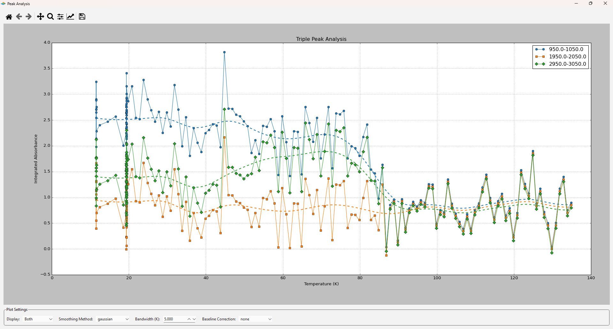

# OPUS Visualizator


A tool for visualizing and analyzing OPUS spectral data with temperature correlation and peak analysis.

---

## 📦 Installation

You can run the project either from source or build it into an executable.

### 1. Clone the repository

```bash
git clone https://github.com/vadondaniel/opus-spectrum-visualizator.git
cd opus-spectrum-visualizator
```

### 2. Install

#### In **Terminal**

```bash
pip install -r requirements.txt
```

---

## 🚀 Running the Application

Launch the application:

```bash
python main.py
```

---

## ⚙️ Building an Executable

To create a standalone `.exe` with **PyInstaller**:

```bash
pyinstaller --onefile --windowed --additional-hooks-dir=hooks main.py
```

It will be at `dist/main.exe`

---

## 📚 Usage Guide

1. Select the folder containing OPUS files.
2. Select the `.txt` file containing temperature data.
3. Start the processing.
4. For 3D visualization: set desired options, then click **Plot 3D**.
5. For peak analysis: adjust parameters, then either

   - click **Export as CSV** to save results, or
   - click **Peak Analysis** to visualize directly.

---

## 🖼 Screenshots

### Main Interface

  

### 3D Visualization

    
  

### Peak Analysis

  

---

## 🛠 Libraries Used

- **PyQt6** – graphical interface
- **matplotlib** – 2D & 3D plotting
- **pandas & numpy** – data parsing and correlation
- [**SpectroChemPy**](https://github.com/spectrochempy/spectrochempy) – OPUS file processing

---

## 📄 License & Attribution

This project uses `read_opus.py` by **LCS – Laboratoire Catalyse et Spectrochimie, Caen, France**, licensed under **CeCILL-B**.

- You may use, modify, and distribute this software.
- Attribution must be retained.
- Provided "as-is" without warranty.

Original source: [SpectroChemPy GitHub](https://github.com/spectrochempy/spectrochempy/)
